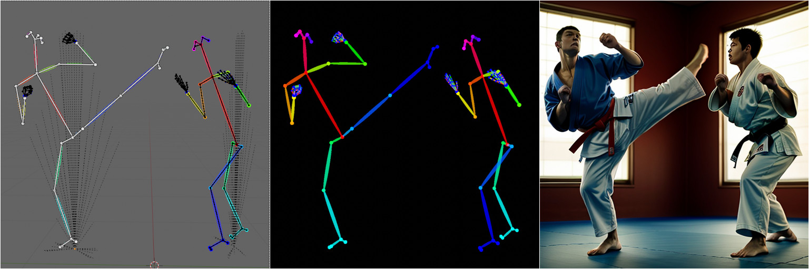

com.io7m.visual.openpose_rig
===



## Description

The contents of this repository provide rigged 
[Blender](https://www.blender.org/) models for working with 
[OpenPose](https://github.com/CMU-Perceptual-Computing-Lab/openpose).

More precisely, the models are rigged skeletons that emulate the appearance of
the skeleton models that OpenPose infers from photographs. The intention is to 
provide a poseable 3D model that can be used as input to systems such as 
[Stable Diffusion](https://github.com/Stability-AI/StableDiffusion).

## Usage

The provided `.blend` files contain models with associated armatures. 

Append the models and armatures into your own scenes and pose them.

Set the Blender environment lighting to pure black: 


Set the scene's color management to plain sRGB without any view transform
(most installations default to Filmic at the time of writing):


Render the image and use the resulting image as input to the
[ControlNet OpenPose model](https://github.com/lllyasviel/ControlNet#controlnet-with-human-pose).

## Models

| File                           | Description               |
|--------------------------------|---------------------------|
| [Body25.blend](Body25.blend)   | The OpenPose Body25 model |
| [Hand.blend](Hand.blend)       | An OpenPose hand model    |
| [Example.blend](Example.blend) | An example scene          |

## Colors

Systems that process OpenPose skeletons essentially infer which body parts are 
which by inspecting the colors of the joints and bones in the images. 

Unfortunately, the only way to determine which color is associated with which
body part is by looking at the OpenPose source code.

Implementations that process OpenPose skeletons seem to be highly permissive
(presumably because skeletons are being inspected using a model trained on the
colors, rather than using a program looking for exact pixel color values).

### Body25

The `Body25` model uses the colors in the following table for joints:

| Index | Name      | Color (RGB) |
|-------|-----------|-------------|
| 0     | Nose      | `ff0055`    |
| 1     | Neck      | `ff0000`    |
| 2     | RShoulder | `ff5500`    |
| 3     | RElbow    | `ffaa00`    |
| 4     | RWrist    | `ffff00`    |
| 5     | LShoulder | `aaff00`    |
| 6     | LElbow    | `55ff00`    |
| 7     | LWrist    | `00ff00`    |
| 8     | MidHip    | `ff0000`    |
| 9     | RHip      | `00ff55`    |
| 10    | RKnee     | `00ffaa`    |
| 11    | RAnkle    | `00ffff`    |
| 12    | LHip      | `00aaff`    |
| 13    | LKnee     | `0055ff`    |
| 14    | LAnkle    | `0000ff`    |
| 15    | REye      | `ff00aa`    |
| 16    | LEye      | `aa00ff`    |
| 17    | REar      | `ff00ff`    |
| 18    | LEar      | `5500ff`    |
| 19    | LBigToe   | `0000ff`    |
| 20    | LSmallToe | `0000ff`    |
| 21    | LHeel     | `0000ff`    |
| 22    | RBigToe   | `00ffff`    |
| 23    | RSmallToe | `00ffff`    |
| 24    | RHeel     | `00ffff`    |

For the bones that run between the joint objects, the same colors are used
as for the joints but rendered at `0.6` opacity with additive blending.

These colors were derived from the values given in the
[poseParametersRender.hpp](https://github.com/CMU-Perceptual-Computing-Lab/openpose/blob/1f1aa9c59fe59c90cca685b724f4f97f76137224/include/openpose/pose/poseParametersRender.hpp#L19)
file.

### License

```
Copyright © 2023 Mark Raynsford <code@io7m.com> http://io7m.com

This work is placed into the public domain for free use by anyone
for any purpose. It may be freely used, modified, and distributed.

In jurisdictions that do not recognise the public domain this work
may be freely used, modified, and distributed without restriction.

This work comes with absolutely no warranty.
```
